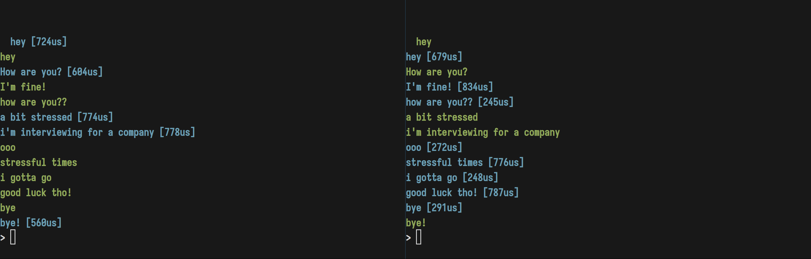

Ahrefs-chat is a one-to-one chat implemented in OCaml, to be run in Unix with a terminal ui.

# Lean-and-mean branch

There has been some feedback that the original design was too complicated. Some answer to
the feedback can be found below. If you're not aware of the context, it might sound strange.

This branch explores a simplification of the general design, shedding the UI components.
The chat now sends messages in linear order, acks no longer linked with the messages.

We've dropped to lwt routines as well, keeping only two readers for stdin and the socket,
making sure that we can receive messages and read from stdin at the same time.

The two threads communicated the roundtrip time trhough a `Ptime.span Queue.t Lwt_mvar.t`
`ack_mbox` mailbox.

#### Feedback Answer

> keeping processed messages in memory adds unnecessary overhead.

To the extent of my knowledge, it's necessary to keep in memory some of the more
recent messages as to update the UI. At least, we should need to store some info about them
to correctly reflect the acknowledgements.

> The proposed database storage isn’t well suited for the scope of the task.

To be honest, I didn't want to suggest one should implement a database for the project as-is.
It was more a suggestion, *should one want the user to see a history of their message when they
re-open the software.* I didn't specify as I thought it was obvious, but I can see how it might
not be. This one's on me.

> The architecture for handling console and network output introduces extra layers of complexity
that makes it harder to follow.

I thought that having a thread for each kind of IO was standard practice.



# Run it!

Install everything:
```
$ opam switch create . 5.1.0 --no-install
$ opam install . --deps-only --with-test
$ dune build
```

run the server

```
$ dune exec bin/main.exe -- server <port>
```

then open another terminal and run the client.

```
$ dune exec bin/main.exe -- client <host> <port>
```

Happy chatting!

### Feature points

#### Message size
We don't want to read a message that would by several gigabytes.
Thus, the messages are split if they're too big. `Config.max_msg_size`
holds the max size of a message.
