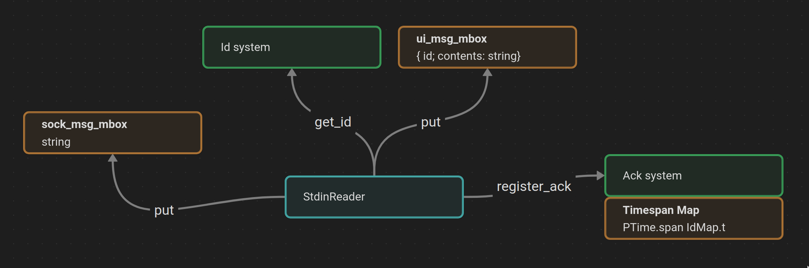
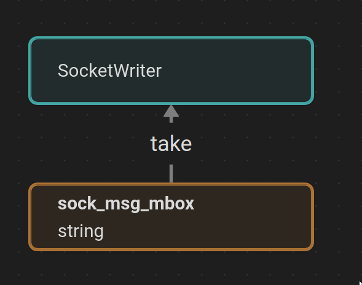
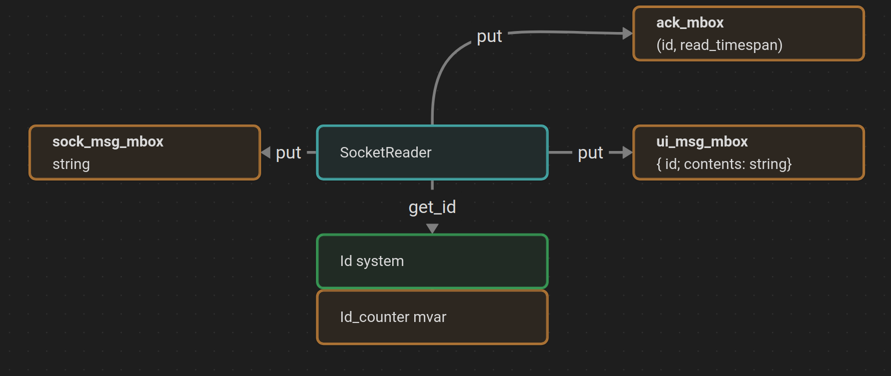
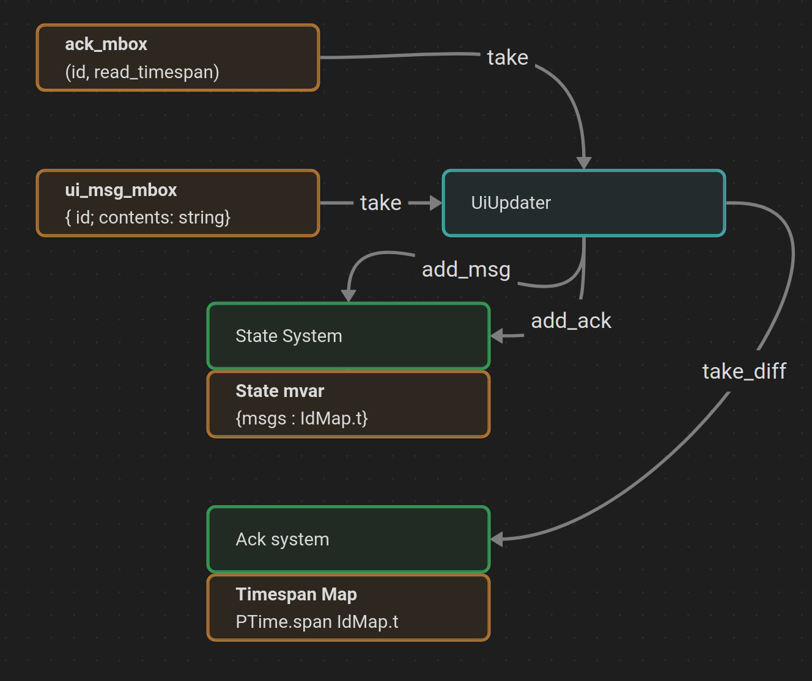
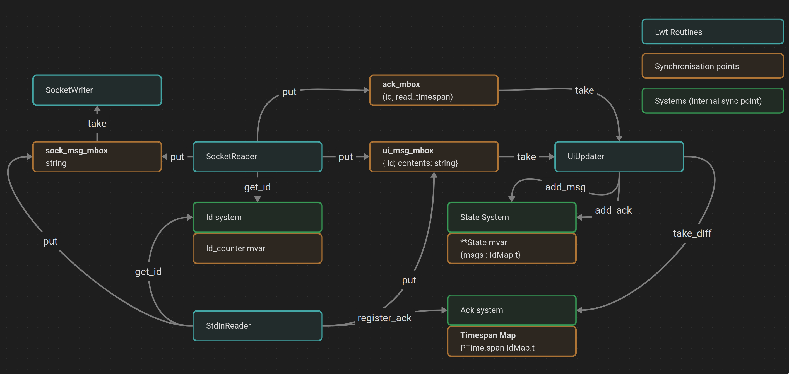

Ahrefs-chat is a one-to-one chat implemented in OCaml, to be run in Unix with a terminal ui.


# Run it!

Install everything:
```
$ opam switch create . 5.1.0 --no-install
$ opam install . --deps-only --with-test
$ dune build
```

run the server

```
$ dune exec bin/main.exe -- server <port>
```

then open another terminal and run the client.

```
$ dune exec bin/main.exe -- client <host> <port>
```

Happy chatting!

# How it works
The client and server both run the same code.
They run 4 lwt routines, one for each read/write operation (stdin r/w, socket r/w)
Inter-thread cooperations is possible through the use of synchronization points, lwt maiboxes (`Lwt_mvar.t`)

### The StdinReader

It waits for a message on stdin. When a message is input, 
it requires a new id for the message, encodes it and writes it
to the sock_msg mailbox. It then captures the time, and registers it
through the ack_system. Then, it puts the message and the id into
the ui_msg mailbox.



### The SocketWriter

It waits on the sock_msg mailbox. When a message is there, it sends it through the socket.



### The SocketReader

It waits on a message on the socket. When a message arrives, it does
two things depending on the message type. If it's an ack, it captures
the time the ack arrived, and puts its id and timestamp in the ack mailbox.

If it's a message, it firsts sends an ack with the message id as its payload. It queries the id system for a new id, decodes the message and puts them in the ui_msg mailbox.



### The UiUpdater

This routine is actually made of two subroutines. One takes what's in
the ui_msg mailbox, and adds it the Ui state which prints the state.

The other takes what's in the ack mailbox. It queries the ack system
to know the difference between the reception of the ack and when the
message originated. It then adds that timespan to the ui state, which
prints it.



### all of them
Here is a schema representing the full system!



### Ui

All the messages stored are printed when the state changes (message or ack received). That borks what was written in the terminal for stdin input, but oh well.

### Improvements possible

* A DB for more messages
* A true TTY input field
* Encode message in binary instead of plain text
* Use string sanitization for messages, instead of possibly borking the terminal :d
* Have a strategy for when you're send/received near to max_int messages

### Feature points

#### Message size
We don't want to read a message that would by several gigabytes.
Thus, the messages are split if they're too big. `Config.max_msg_size`
holds the max size of a message.

#### Ack
How to match an acknowledgement with the correct message? Those
socket are opened using TCP, so order should be preserved, but 
this seems flimsy. Thus, every messsage has an id, which is transmitted
on the network, and back as ack payload.

#### Ui

We don't want to saturate the memory with old messages. Config has a field that sets the max messages stored in ram.
