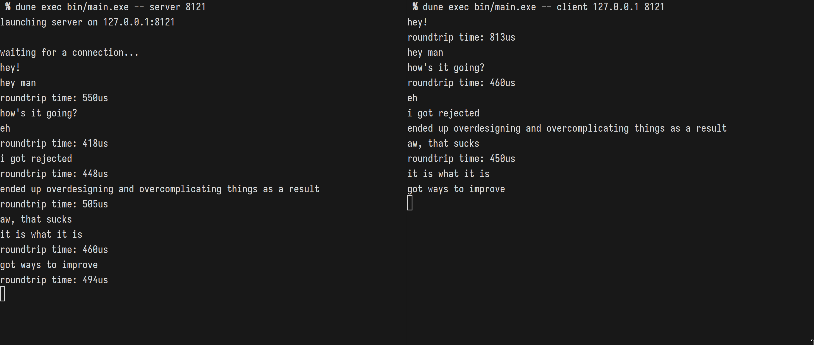

Ahrefs-chat is a one-to-one chat implemented in OCaml, to be run in Unix with a terminal ui.

# Lean-and-mean branch

This branch explores a simplification of the general design, shedding the UI components.
The chat now sends messages in linear order, acks no longer linked with the messages.

We've dropped to lwt routines as well, keeping only two readers for stdin and the socket,
making sure that we can receive messages and read from stdin at the same time.

The two threads communicated the roundtrip time trhough a `Ptime.span Queue.t Lwt_mvar.t`
`ack_mbox` mailbox.



# Run it!

Install everything:
```
$ opam switch create . 5.1.0 --no-install
$ opam install . --deps-only --with-test
$ dune build
```

run the server

```
$ dune exec bin/main.exe -- server <port>
```

then open another terminal and run the client.

```
$ dune exec bin/main.exe -- client <host> <port>
```

Happy chatting!

### Feature points

#### Message size
We don't want to read a message that would by several gigabytes.
Thus, the messages are split if they're too big. `Config.max_msg_size`
holds the max size of a message.
